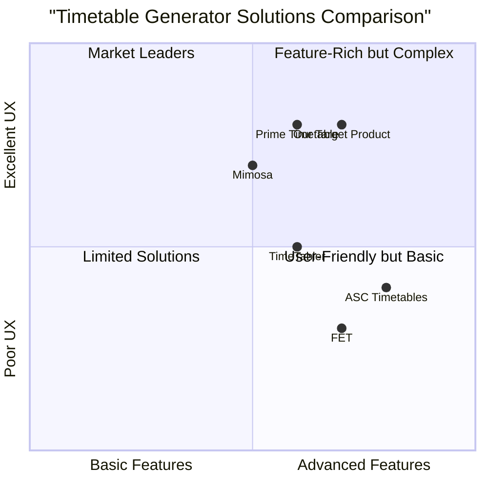
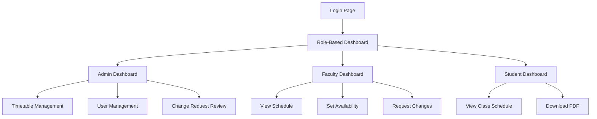

# TimeTable Generator PRD (Product Requirements Document)

## 1. Project Overview

### 1.1 Project Information
- **Project Name**: timetable_generator
- **Programming Language**: Python
- **Framework**: React (Frontend), Flask/Django (Backend)
- **Original Requirements**: A Python-based web application for automated timetable generation with dashboard interface, supporting multiple user roles, genetic algorithm-based scheduling, and various features including collision prevention, faculty availability management, and role-based access control.

### 1.2 Product Goals
1. Streamline the academic timetable creation process through automation and intelligent scheduling
2. Provide role-specific access and functionality for administrators, faculty, and students
3. Ensure conflict-free scheduling while maintaining academic scheduling constraints

### 1.3 User Stories

1. As an administrator, I want to input course and faculty data so that I can generate conflict-free timetables for the department.
2. As a faculty member, I want to set my availability preferences and view my teaching schedule so that I can manage my time effectively.
3. As a student, I want to view my semester's timetable so that I can plan my academic activities.
4. As an administrator, I want to review and approve faculty change requests so that I can maintain schedule integrity.
5. As a faculty member, I want to request schedule changes so that I can accommodate unexpected conflicts.

## 2. Competitive Analysis

### 2.1 Market Overview

Here's a competitive analysis of similar timetable generation solutions:

1. **ASC Timetables**
   - Pros:
     - Comprehensive scheduling solution
     - Multiple constraint handling
     - Export capabilities
   - Cons:
     - Complex interface
     - High learning curve
     - Desktop-only solution

2. **TimeTabler**
   - Pros:
     - Automated conflict resolution
     - Multiple export formats
     - Quick scheduling
   - Cons:
     - Limited customization
     - No web interface
     - Limited role management

3. **FET (Free Education Timetabling)**
   - Pros:
     - Open-source
     - Highly configurable
     - Strong constraint system
   - Cons:
     - Basic UI
     - Limited user management
     - Complex setup process

4. **Mimosa Scheduling Software**
   - Pros:
     - User-friendly interface
     - Good visualization
     - Multiple export options
   - Cons:
     - Limited automation
     - No web version
     - Expensive

5. **Prime Timetable**
   - Pros:
     - Web-based solution
     - Modern interface
     - Good collaboration features
   - Cons:
     - Limited algorithm customization
     - Basic reporting
     - High subscription cost

### 2.2 Competitive Positioning Chart

## 3. Technical Requirements

### 3.1 Core Features

#### P0 (Must Have)
1. **User Management**
   - Role-based authentication (Admin, Faculty, Student)
   - Self-signup capability with admin approval
   - Role-specific dashboards and views

2. **Timetable Generation**
   - Genetic algorithm implementation
   - Collision prevention between classes
   - Faculty availability consideration
   - Priority-based scheduling
   - Theory/lab hour allocation

3. **Data Management**
   - Course information storage
   - Faculty availability data
   - Historical timetable archives
   - Export functionality (PDF)

#### P1 (Should Have)
1. **Schedule Management**
   - Faculty change request system
   - Admin review interface
   - Manual schedule adjustment tools
   - Bulk data import/export

2. **Visualization**
   - Weekly grid view
   - Faculty-specific views
   - Class-specific views
   - Department-wide overview

#### P2 (Nice to Have)
1. **Analytics**
   - Usage statistics
   - Scheduling efficiency metrics
   - Faculty workload distribution
   - Historical data analysis

### 3.2 Technical Specifications

#### Backend Architecture
- Python 3.8+
- Flask/Django web framework
- SQLAlchemy/Django ORM
- JWT authentication
- RESTful API design

#### Frontend Architecture
- React.js
- Tailwind CSS
- Responsive design
- Grid layout system
- PDF generation library

#### Database Schema
- Users table (roles, permissions)
- Courses table (type, credits, hours)
- Faculty availability table
- Timetable storage table
- Change request tracking table

### 3.3 UI Design Draft

## 4. User Interface Requirements

### 4.1 Common Elements
- Navigation menu
- User profile section
- Logout option
- Help documentation
- PDF export button

### 4.2 Admin Dashboard
- Timetable generation controls
- Faculty management
- Course management
- Change request review panel
- System settings

### 4.3 Faculty Dashboard
- Personal schedule view
- Availability management form
- Change request submission
- Department timetable view

### 4.4 Student Dashboard
- Semester timetable view
- PDF download option
- Course list view

## 5. Data Requirements

### 5.1 Course Data
- Course code
- Course name
- Course type (Theory/Lab)
- Credit hours
- Weekly hours
- Priority level

### 5.2 Faculty Data
- Personal information
- Availability slots
- Subject expertise
- Maximum weekly hours

### 5.3 Timetable Data
- Semester information
- Class schedules
- Time slots
- Subject allocations

## 6. Non-Functional Requirements

### 6.1 Performance
- Page load time < 2 seconds
- Timetable generation < 5 minutes
- Support for 1000+ concurrent users
- 99.9% uptime

### 6.2 Security
- Role-based access control
- Password encryption
- Session management
- Data backup

### 6.3 Usability
- Intuitive navigation
- Responsive design
- Cross-browser compatibility
- Accessible interface

## 7. Out of Scope
1. Room allocation system
2. Notification system
3. Mobile application
4. Real-time collaboration
5. Integration with other systems

## 8. Open Questions

1. Should the system support multiple departments?
2. What should be the maximum iteration limit for the genetic algorithm?
3. How should the system handle faculty leaves and holidays?
4. What should be the format for bulk data import?

## 9. Success Metrics

1. **User Adoption**
   - 100% faculty registration
   - 90% student registration
   - 80% weekly active users

2. **System Performance**
   - Zero scheduling conflicts
   - 95% first-time generation success
   - < 1% manual adjustments needed

3. **User Satisfaction**
   - > 4/5 user satisfaction rating
   - < 5% change requests per semester
   - < 2 minutes average task completion time